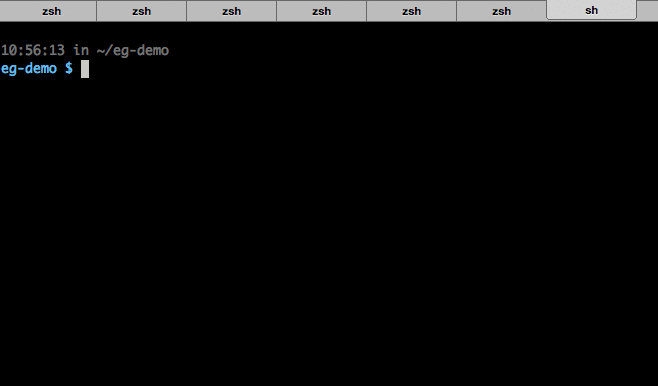
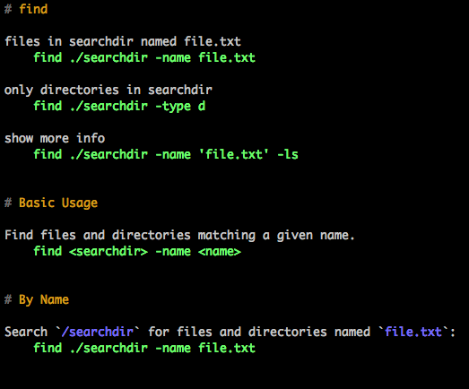

# eg

> Useful examples at the command line.

[](https://travis-ci.org/srsudar/eg)

## Overview

`eg` provides examples of common uses of command line tools.

Man pages are great. How does `find` work, again? `man find` will tell you, but
you'll have to pore through all the flags and options just to figure out a
basic usage. And what about using `tar`? Even with the man pages `tar` is
[famously inscrutable without the googling for examples](http://xkcd.com/1168/).

No more!

`eg` will give you useful examples right at the command line. Think of it as a
companion tool for `man`.

> `eg` comes from _exempli gratia_, and is pronounced like the letters: "ee
gee".




## Installation

### With `pip`

```shell
pip install eg
```

### With `brew`

```shell
brew install eg-examples
```

### Run from source

Clone the repo and create a symlink to `eg_exec.py`. Make sure the location you
choose for the symlink is on your path:


```shell
git clone https://github.com/srsudar/eg ./
ln -s /absolute/path/to/eg-repo/eg_exec.py /usr/local/bin/eg
```

> Note that the location of `eg_exec.py` changed in version 0.1.x in order to
support Python 3 as well as 2. Old symlinks will print a message explaining the
change, but you'll have to update your links to point at the new location. Or
you can install with `pip` or `brew`.

`eg` doesn't ship with a binary. Dependencies are very modest and should not
require you to install anything (other than [pytest](https://docs.pytest.org) if
you want to run the tests).  If you find otherwise, open an issue.


## Usage

`eg <program>`

`eg` takes an argument that is the name of a program for which it contains
examples.

`eg find` will provide examples for the `find` command.

`eg --list` will show all the commands for which `eg` has examples.

The complete usage statement, as shown by `eg --help`, is:

```
eg [-h] [-v] [-f CONFIG_FILE] [-e EXAMPLES_DIR] [-c CUSTOM_DIR] [-p PAGER_CMD]
   [-l] [--color] [-s] [--no-color] [program]
```


## How it Works

Files full of examples live in `examples/`. A naming convention is followed
such that the file is the name of the tool with `.md`. E.g. the examples for
`find` are in `find.md`.

`eg find` will pipe the contents of `find.md` through `less` (although it tries
to respect the `PAGER` environment variable).


## Configuration and Extension

`eg` works out of the box, no configuration required.

If you want to get fancy, however, `eg` can be fancy.

For example, maybe a team member always sends you bzipped tarballs and you can
never remember the flag for bzipping--why can't that guy just use gzip
like everybody else? You can create an example for untarring and unzipping
bzipped tarballs, stick it in a file called `tar.md`, and tell `eg` where to
find it.

The way to think about what `eg` does is that it takes a program name, for
example `find`, and looks for files named `find.md` in the default and custom
directories (including subdirectories). If it finds them, it pipes them through
`less`, with the custom files at the top. Easy.

The default and custom directories can be specified at the command line like
so:

```shell
eg --examples-dir='the/default/dir' --custom-dir='my/fancy/dir' find
```

Instead of doing this every time, you can define a configuration file. It must
begin with a section called `eg-config` and can contain two keys: `custom-dir`
and `examples-dir`. Here is an example of a valid config file:

    [eg-config]
    examples-dir = ~/examples-dir
    custom-dir = ~/my/fancy/custom/dir

The config file is looked for first at `${XDG_CONFIG_HOME}/eg/egrc` and then at
`~/.egrc`. You can also specify a different location at the command line like
so:

```shell
eg --config-file=myfile find
```

## Editing Your Custom Examples

If you want to edit one of your custom examples, you can edit the file directly
or you can just use the `-e` or `--edit` flag.

To edit your `find` examples, for example, you could say:

```shell
eg -e find
```

This will dump you into an editor. The contents will be piped before the default
examples the next time you run `eg find`.

## Formatting Output

`eg` is highly customizable when it comes to output. You have three ways to try
and customize what is piped out the pager, applied in this order:

1. Color
1. Squeezing out excess blank lines
1. Regex-based substitutions

### Color

`eg` is colorful. The default colors were chosen to be pretty-ish while boring
enough to not create problems for basic terminals. If you want to override
these colors, you can do so in the egrc in a `color` section.

Things that can be colored are:

* `pound`: pound sign before headings
* `heading`: the text of headings
* `code`: anything indented four spaces other than a leading `$`
* `prompt`: a `$` that is indented four spaces
* `backticks`: anything between two backticks

Values passed to these options must be string literals. This allows escape
characters to be inserted as needed. An egrc with heading text a nice burnt
orange might look like this:

    [eg-config]
    custom-dir = ~/my/fancy/custom/dir

    [color]
    heading = '\x1b[38;5;172m'

To remove color altogether, for example if the color formatting is messing up
your output somehow, you can either pass the `--no-color` flag to `eg`, or you
can add an option to your egrc under the `eg-config` section like so:

    [eg-config]
    color = false


### Squeezing Blank Lines

The example files use a lot of blank lines to try and be readable at a glance.
Not everyone likes this many blank lines. If you hate all duplicate lines, you
can use your favorite pager to remove all duplicate commands, like:

```
eg --pager-cmd 'less -sR' find
```

This will use `less -sR` to page, which will format color correctly (`-R`) and
remove all duplicate blank lines (`-s`).

`eg` also provides its own custom squeezed output format, removing all blank
lines within a single example and only putting duplicate blank lines between
sections. This can be configured at the command line with `--squeeze` or in
the egrc with the `squeeze` option, like:

    [eg-config]
    squeeze = true

Running `eg --squeeze find` removes excess newlines like so:




### Regex Substitutions

Additional changes to the output can be accomplished with regular expressions
and the egrc. Patterns and replacements are applied using Python's `re` module,
so look to the [documentation](https://docs.python.org/2/library/re.html) for
specifics. Substitutions should be specified in the egrc as a list with the
syntax: `[pattern, replacement, compile_as_multiline]`. If
`compile_as_multiline` is absent or `False`, the pattern will not be compiled
as multiline, which affects the syntax expected by `re`. The `re.sub` method is
called with the compiled pattern and `replacement`.

Substitutions must be named and must be in the `[substitutions]` section of the
egrc. For example, this would remove all the four-space indents beginning
lines:

    [substitutions]
    remove-indents = ['^    ', '', True]

This powerful feature can be used to perform complex transformations, including
support additional coloring of output beyond what is supported natively by
`eg`. If you wish there was an option to remove or add blank lines, color
something new, remove section symbols, etc, this is a good place to start.

If multiple substitutions are present, they are sorted by alphabetically by
name before being applied.


## Paging

By default, `eg` pages using `less -RMFXK`. The `-R` switch tells `less` to
interpret ANSI escape sequences like color rather than showing them raw. `-M`
tells it to show line number information in the bottom of the screen. `-F` to
automatically quit if the entire example fits on the screen. `-X` tells it not
to clear the screen. Finally, `-K` makes `less` exit in response to `Ctrl-C`.

You can specify a different pager using the `--pager-cmd` option at the command
line or the `pager-cmd` option in the egrc. If specified in the egrc, the value
must be a string literal. For example, this egrc would use `cat` to page:

    [eg-config]
    pager-cmd = 'cat'

`pydoc.pager()` does a lot of friendly error checking, so it might still be
useful in some situations. If you want to use `pydoc.pager()` to page, you can
pass the `pydoc.pager` as the `pager-cmd`.


## Format and Content of Examples

Example documents are written in [markdown](http://daringfireball.net/projects/markdown/syntax).
Documents in markdown are easily read at the command line as well as online.
They all follow the same basic format.

This section explains the format so that you better understand how to quickly
grok the examples.

Contributors should also pay close attention to these guidelines to keep
examples consistent.


## Overview

Anything indented four spaces or surrounded by backticks \`like this\` are
meant to be input or output at the command line. A single line indented four
spaces is a user-entered command. If a block is indented four spaces, only the
lines beginning with `$` are user-entered--anything else is output.


### Name of the Command

The first section heading should be simply the name of the tool. It should be
followed by the most rudimentary examples. Users that are familiar with the
command but just forget the precise syntax should be able to see what they need
without scrolling. Example commands should be as real-world as possible, with
file names and arguments as illustrative as possible. Examples for the `cp`
command, for instance, might be:

    cp original.txt copy.txt

Here the `.txt` extensions indicate that these are file names, while the names
themselves make clear which is the already existing file and which will be the
newly created copy.

This section shouldn't show output and should not include the `$` to indicate
that we are at the command line.

**This section should be a quick glance for users that know what the tool does,
know a basic usage is what they are trying to do, and are just looking for a
reminder.**


### Basic Usage

Next a Basic Usage section explains the most basic usage without using real
file names. This section gives users that might not know the usual syntax a
more abstract example than the first section. It is intended to provide a more
useful explanation than the first entry in the man page, which typically shows
all possible flags and arguments in a way that is not immediately obvious to
new users of the command. The SYNOPSIS section of the man page for `cp`, for
example, shows:

    cp [-R [-H | -L | -P]] [-fi | -n] [-apvX] source_file ... target_directory

**The Basic Usage is intended to provide less verbose, more immediately
practical versions of the man page's SYNOPSIS section.**

Commands and flags that will affect the behavior are shown as would be entered
in the command line, while user-entered filenames and arguments that do not
alter the command's behaviors are shown in `< >`. Examples in the Basic Usage
section for the `cp` command, for instance, might be:

    cp -R <original_directory> <copied_directory>

In this command the `cp -R` indicate the command and behavior and thus are not
given in `< >`. Case-dependent components of the command, in this case the
directory to be copied and the name of the copy, are surrounded with `< >`.
Each is wrapped in separate `< >` to make clear that it is in fact two
distinct arguments.

### Additional Sections

Subsequent subsections can be added for common uses of the tools, as
appropriate.

### Formatting

Although markdown is readable, it can still be tricky without syntax
highlighting. We use spacing to help the eye.

1. All code snippets are followed by at two blank lines, unless overruled by 2.

2. Each line beginning a section (i.e. the first character on the line is `#`)
should be preceded by exactly three lines.

3. Files should end with two blank lines.

4. Lines should not exceed 80 characters, unless to accommodate a necessarily
   long command or long output.


## Contributing

Additions of new tools and new or more useful examples are welcome. `eg` should
be something that people want to have on their machines. If it has a man page,
it should be included in `eg`.

Please read the Format of Examples section and review existing example files to
get a feel for how `eg` pages should be structured.

If you find yourself turning to the internet for the same command again and
again, consider adding it to the examples.

`eg` examples do not intend to replace man pages! `man` is useful in its own
right. `eg` should provide quick examples in practice. Do not list all the
flags for the sake of listing them. Assume that users will have `man`
available.


### Building and Running Tests

`eg` depends only on standard libraries and Python 2.x/3.x, so building should
be a simple matter of cloning the repo and running the executable `eg/eg.py`.

`eg` uses pytest for testing, so you'll have to have it installed to run tests.
Once you have it, run `py.test` from **the root directory of the repo**.

Tests should always be expected to pass. If they fail, please open an issue,
even if only so that we can better elucidate `eg`'s dependencies.


## Grace Hopper Approves

Alias `eg` to `woman` for something that is like `man` but a little more
practical:

```shell
$ alias woman=eg
$ man find
$ woman find
```
